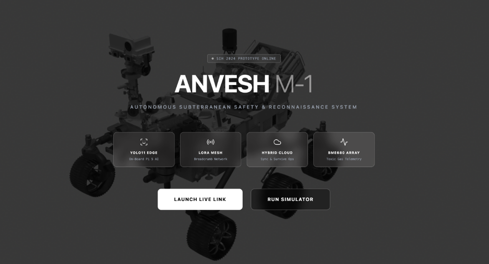

  

# ANVESH Core Architecture (SIH Demo)

Welcome to the ANVESH architectural documentation branch. This branch is specifically tailored for the **Smart India Hackathon** judges to review the core system design, data workflows, and AI pipeline logic.

### Documentation Files:
1. [System Architecture & Hardware Link](docs/SYSTEM_ARCHITECTURE.md)
2. [AI Pipeline & Multithreading Workflow](docs/AI_WORKFLOW.md)

*Note: The massive `.pt` neural network weights and frontend UI codebase are excluded from this branch to maintain a lightweight core architecture view.*
3. [Mission Control Dashboard (UI Screenshots)](docs/visual_docs.md)
