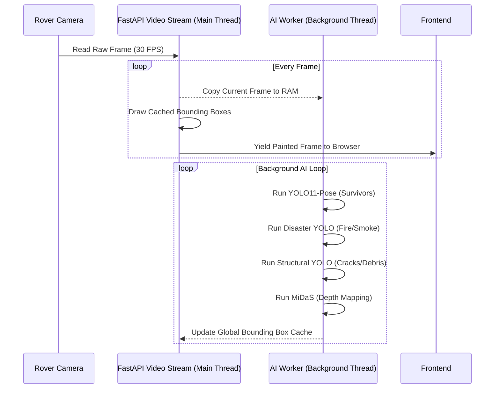

# ANVESH AI Pipeline Workflow

To maintain a flawless 30+ FPS video feed from the rover while running 4 complex Neural Networks simultaneously, ANVESH utilizes an **Asynchronous Thread Decoupling** architecture.

## Dual-YOLO + MiDaS Flow Diagram

## Model Roster
* **YOLO11-Pose:** Dedicated to detecting human survivors and analyzing their posture (Standing, Crouching, Lying down).
* **Disaster YOLO (Custom):** Detects environmental threats like `FIRE` and `SMOKE`.
* **Structural YOLO (Custom):** Detects physical obstacles like `DEBRIS` and `CRACKS`.
* **MiDaS (PyTorch Hub):** Generates a real-time relative depth map (COLORMAP_INFERNO) to estimate distance to obstacles without relying solely on LiDAR.
