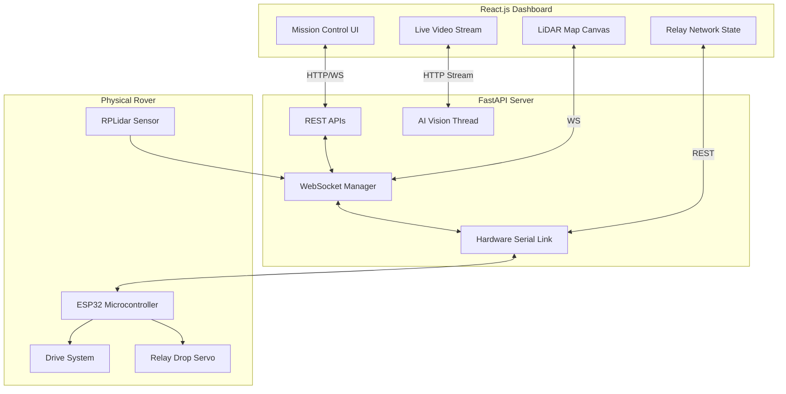

# ANVESH Ground Station - Core Architecture

This document outlines the core architecture of the ANVESH Disaster Response Rover Ground Station, built for the **Smart India Hackathon (SIH)**.

## High-Level System Design

The system is completely decoupled, ensuring that heavy AI processing does not bottleneck the live hardware telemetry or video feeds. 

## Core Components
1. **Frontend (React + Tailwind):** A tactical dark-mode interface designed for high-stress disaster response environments.
2. **Backend (FastAPI):** Python-based asynchronous server that bridges the web dashboard with the physical rover hardware.
3. **Hardware Link (PySerial):** Bi-directional communication pipeline speaking a custom `CMD:ACTION:VAL` protocol to the ESP32.
