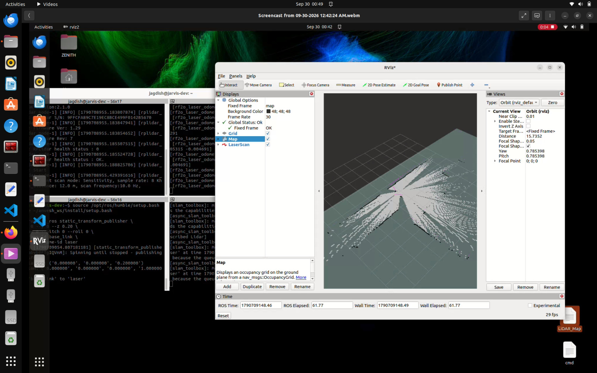

# ANVESH Visual Documentation

A comprehensive visual reference of the ANVESH disaster-response robot — from physical hardware to the ground station dashboard.

---

## 🤖 Robot Hardware

### 1. Anvesh Bot — View 1
Front-facing view of the ANVESH robot chassis with sensor array and camera mount.

### 2. Anvesh Bot — View 2
Side profile showing the drive system and relay node deployment mechanism.

### 3. Anvesh Bot — View 3
Top-down view highlighting the onboard compute unit and wiring layout.

### 4. Anvesh Bot — View 4
Rear view displaying battery pack, motor controllers, and communication modules.

### 5. Anvesh Bot — View 5
Close-up of the sensor cluster including LiDAR, BME680 gas sensor, and depth camera.

---

## 🔩 CAD Design (Fusion 360)

### 6. Fusion 360 CAD Design — View 1
Overall assembly render of the ANVESH robot frame in Fusion 360.

### 7. Fusion 360 CAD Design — View 2
Exploded view showing individual chassis components and their fit.

### 8. Fusion 360 CAD Design — View 3
Drivetrain and wheel assembly detail from the CAD model.

### 9. Fusion 360 CAD Design — View 4
Relay node housing and ejection mechanism in CAD.

### 10. Fusion 360 CAD Design — View 5
Sensor mounting bracket and top-plate assembly.

### 11. Fusion 360 CAD Design — View 6
Final full-assembly render with all sub-systems integrated.

---

## 📡 Relay Network & Nodes

### 12. Relay Node (Hardware)
Physical relay node unit used as a communication breadcrumb inside tunnels and debris fields.

### 13. Auto Relay Node Dropping Mechanism
The automated deployment arm that physically drops relay nodes at timed or distance-triggered intervals during a mission.

### 14. Relay Network Topology
Simulated LoRa mesh network diagram showing the 6-step state machine and multi-hop communication chain from robot to operator.

---

## 🖥️ Ground Station Dashboard

### 15. AI Vision
The primary optical feed overlaid with 4 simultaneous Neural Networks — Survivors, Fire/Smoke, Debris/Cracks, and MiDaS Depth Mapping.

### 16. LIDAR Map
Real-time 2D SLAM mapping and point cloud visualization for subterranean navigation in zero-visibility environments.

### 17. Sensors & Telemetry
Live telemetry from the onboard BME680 array monitoring toxic gases (VOCs), temperature spikes, and pressure drops to predict structural failures.

### 18. Relay Node Dashboard Panel
Dashboard view of the LoRa mesh network topology and relay node state machine for the ground station operator.

### 19. RViz SLAM Map (Live Run)
Real-time occupancy grid generated by the `async_slam_toolbox` during an actual robot run — showing the 2D map being built live from LiDAR point cloud data inside RViz, with the robot's position and scan overlaid.

---

## 🏷️ Banner

### 20. ANVESH Banner
Official project banner for the ANVESH disaster-response autonomous robot.

