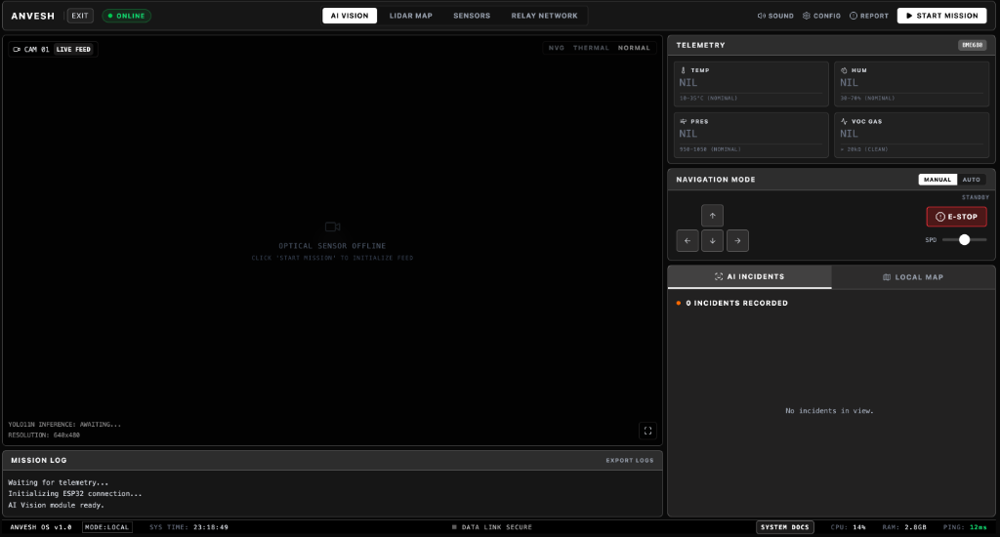
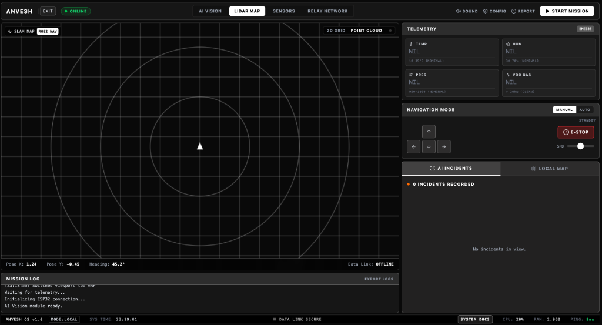
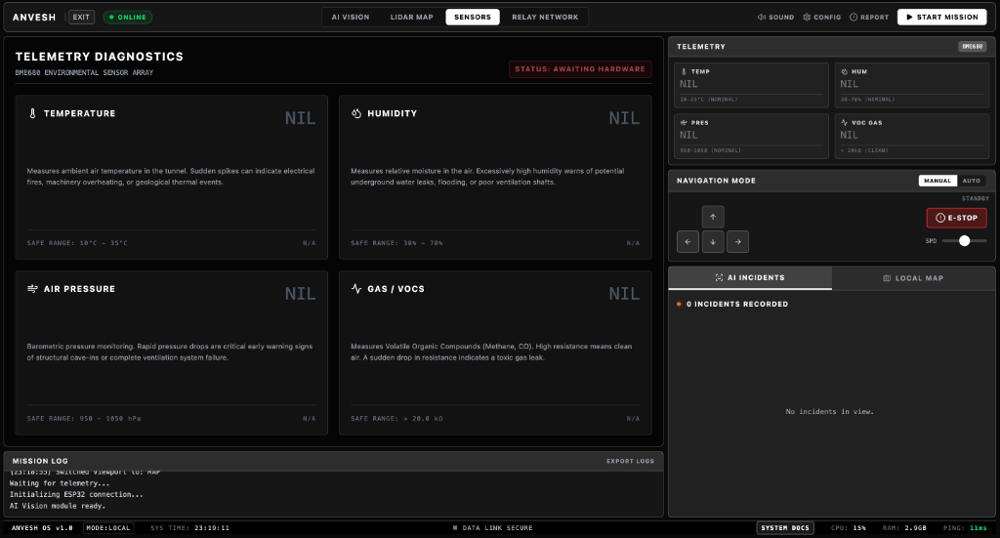
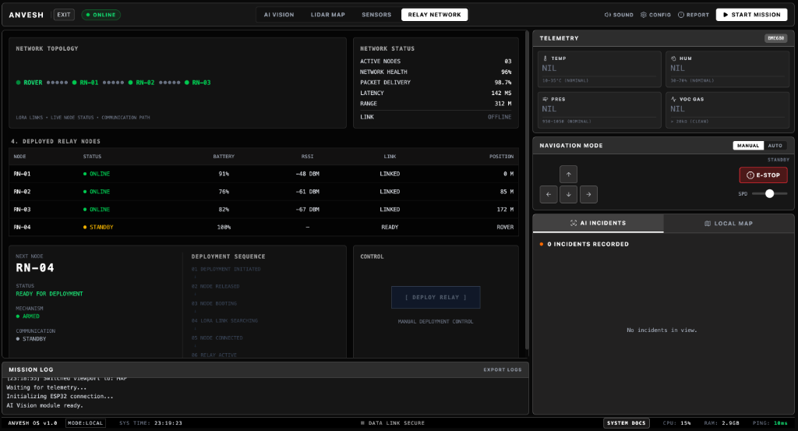

# ANVESH Ground Station Interface

Below are the core mission control interfaces available to operators in the React Dashboard.

### 1. AI Vision
The primary optical feed overlaid with 4 simultaneous Neural Networks (Survivors, Fire/Smoke, Debris/Cracks, and MiDaS Depth Mapping).

### 2. LIDAR Map
Real-time 2D SLAM mapping and point cloud visualization for subterranean navigation in zero-visibility environments.

### 3. Sensors Page
Live telemetry from the onboard BME680 array monitoring toxic gases (VOCs), temperature spikes, and pressure drops to predict structural failures.

### 4. Relay Node
Simulated LoRa mesh network topology and the 6-step state machine for dropping physical communication breadcrumbs deep inside tunnels.

